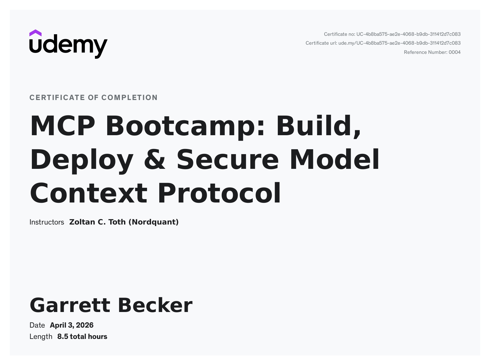

# Udemy - MCP Bootcamp: Build, Deploy & Secure Model Context Protocol

Projects and learning from Zoltan C. Toth's [MCP Bootcamp: Build, Deploy & Secure Model Context Protocol course on Udemy](https://www.udemy.com/course/learn-mcp-model-context-protocol-course-and-a2a-bootcamphands-hands-on/).

### [Certificate](https://www.udemy.com/certificate/UC-4b8ba575-ae2e-4068-b9db-311412d7c083/)

### Course Details

#### What you'll learn
- Understand the Agentic Theory behind Model Context Protocol and what Problems MCP Solves
- Master the architecture, concepts, and features of Model Context Protocol for production applications
- Deploy MCP Services to Production
- Integrate MCP Services into LangGraph, LangChain and LangSmith
- Secure MCP Services using OAuth
- Learn how to find and use MCP for Virtually Every Use Case
- Implement and integrate a functional MCP server with real-time data providing capabilities
- Learn about what's coming up in the MCP world
- MCP using OpenAI's Agents Framework and Responses API
- Dockerizing MCP for Production
- Interviews with Industry Experts

#### Requirements
- Basic programming knowledge required. Familiarity with Python is required. No prior AI or MCP experience needed - we'll teach you everything from the ground up.
- Access to a PC/Mac where you can install Software like Claude, Cursor and Visual Studio Code

#### Description
Build Production-Ready Model Context Protocol (MCP) Solutions - From Zero to Deployment

If you want to understand, integrate, implement, publish, secure and deploy Model Context Protocol (MCP) solutions to production, this course is for you.

Why start learning MCP today? Model Context Protocol is Anthropic's new standard (launched November 2024) that's quickly becoming essential for AI development. Early adopters are already building the next generation of AI applications - and you can too.

This course delivers what many others don't - genuine hands-on experience developing, integrating and deploying MCPs for AI applications. You'll walk away with both the conceptual understanding and practical tools to tackle real-world challenges.

What You'll Actually Build:
- Working MCP servers that connect to Claude Desktop, Cursor and Python
- Production-ready integrations with OpenAI and other LLMs
- Secure, deployable Model Context Protocol solutions
- Deploy MCPs using Docker, Amazon Web Services (AWS), Cloudflare or Render

Student Success Stories:
- "The course structure works brilliantly, starting with essential MCP foundations and methodically building toward practical applications." - Daniel
- "Zoltan does a great job at breaking down the Model Context Protocol concepts so it's easy to learn and build up your knowledge as you go." - Jose
- "Although I had some exposure to AI agents before, I still learned a lot about MCPs that I can use in my daily work." - Stefan

Why Model Context Protocol Matters:
- MCPs solve a critical problem in the multi-LLM world by creating standardized ways for AI models to interact with external systems. This bootcamp takes you from fundamental concepts to production-ready implementations at every step.

Course Structure:
This course follows a hands-on, practical approach. We start with theoretical foundations to understand MCPs in context, then quickly move to building real working applications.

THEORETICAL FOUNDATION:
- How LLM interactions and tool calling work
- The problem MCP solves in a multi-LLM world
- Core concepts and architecture
- MCP features: Tools, Prompts, and Resources
- Where MCPs fit in the AI ecosystem

HANDS-ON DEVELOPMENT:
- Complete development environment setup for Mac & Windows
- Working with MCP hubs and global providers
- Integrating with Claude and Cursor
- Step-by-step creation of your own Crypto Price MCP
- Working with Tools and Resources
- Testing and debugging with MCP Inspector
- LangChain, LangGraph and LangSmith integration
- Building Python and JavaScript-based MCPs
- Production deployment strategies
- Securing MCPs with OAuth
- Deploying to Cloudflare Workers

ADVANCED TECHNIQUES:
- OpenAI Agents integration and the Responses API
- Dockerizing MCPs for production deployment
- Performance optimization strategies
- Enterprise-grade error handling

FUTURE-READY SKILLS:
- Anthropic's MCP Roadmap insights
- The future of Model Context Protocol development
- Preparing for upcoming features

Ready to master the newest AI protocol? Join developers and AI enthusiasts already building with MCP and transform your AI development skills today!

#### Who this course is for:
- AI Enthusiasts who want to get hands-on with MCPs
- Software developers looking to enhance applications with AI capabilities
- AI Engineers
