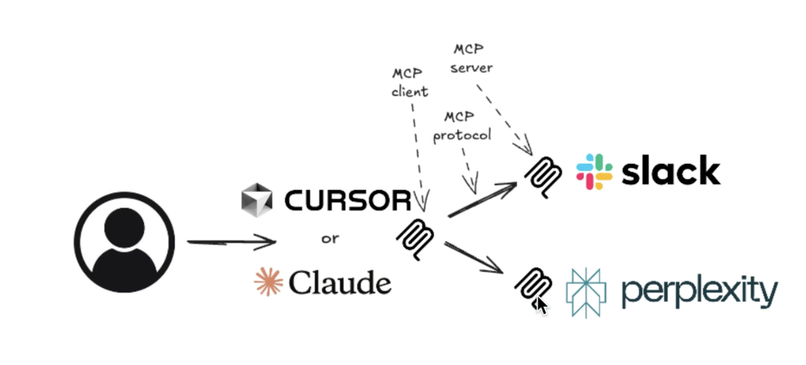

## 02_ MCP Overview and Architecture

### MCP = Model Context Protocol

### The Problem MCPs Solve
- Makes it possible to use different AI servers without having to build an entirely new implementation of that server to use other apps like Slack or Perplexity

### MCP Architecture

- MCP Hosts: programs that want to access MCP services, such as Claude or Cursor
- MCP Protocol: the language MCP clients and servers use for communication and data passing
- MCP Servers: server applications that expose functionalities for LLMs through the MCP Protocol
- MCP Clients: the client modules that maintain connections between an MCP Host and MCP Server

### MCP Functionalities
- Tools: "tool use"
- Resources: providing the LLM with files and assets
- Prompts: providing pre-created prompts
- Only partially supported features
  - Roots: definding which resources to use with this MCP
  - Sampling: classic LLM next token prediction service

### Finding Third-Party MCP Hubs
- https://github.com/modelcontextprotocol/servers
- https://smithery.ai
- https://cursor.directory